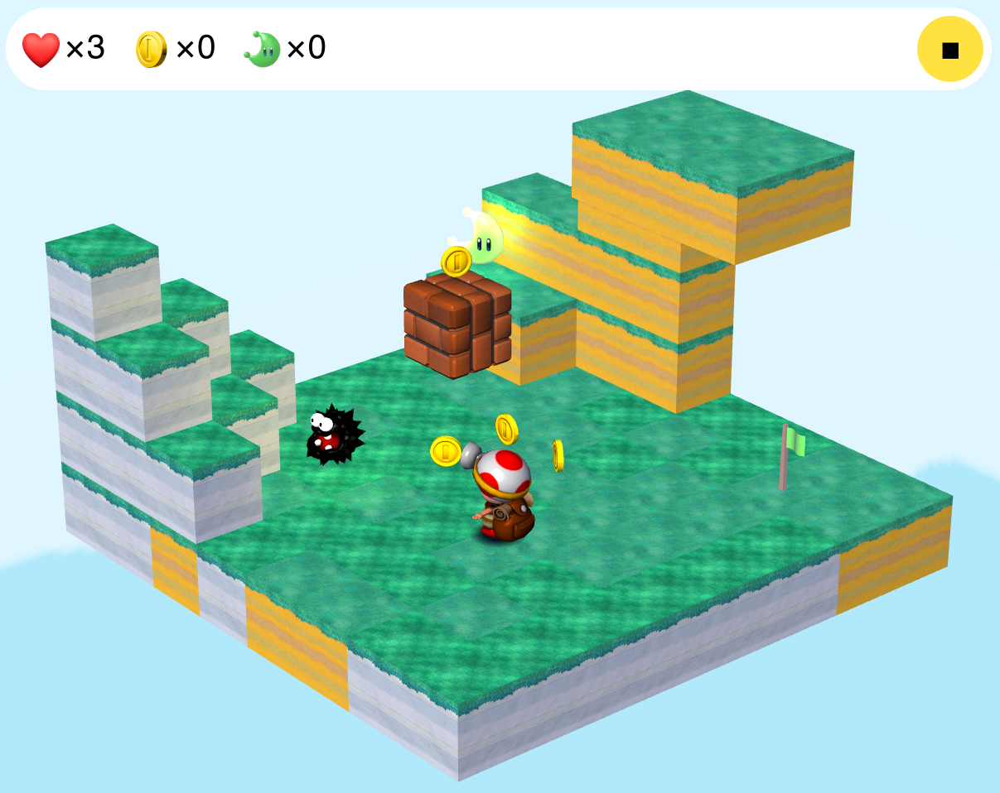
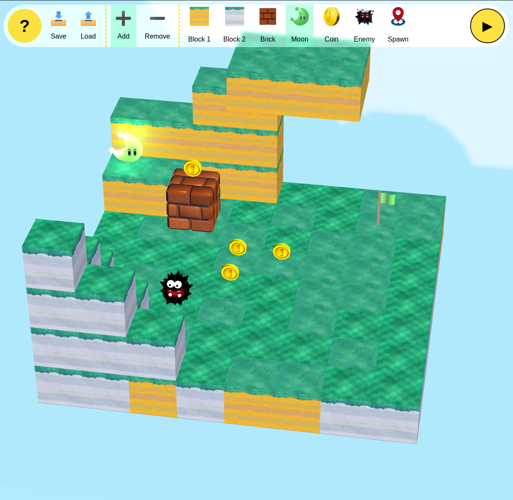

Half of this exam grade was determined by this project.

Once again, I and [@aleasto](https://github.com/aleasto) teamed up to tackle this project.

In short, instead of hacking together various pieces of code, we planned a clean file structure, separating engine components from the actual game implementation.

In less than a month, we had working (point, spot and directional) lights, a rough but functional collision detection/physics and raycast/mouse detection, and even a (fake) shadow which was simply a reversed spotlight.

[**Click here to play the DEMO**](https://cpt-toad-maker.netlify.app/)

_These are a couple of screenshots that show the final result:_

In particular, I worked mostly on:

-  the development environment setup, made with Webpack and with some loader to make it really simple to import GLSL shaders and OBJ files. Also setup up Typescript in order to avoid most of the type errors when working with the WebGL2 API.
-  the UI, because I always end up doing UIs. I should have studied design at university.
-  the raycast (for those familiar with Unity3D terminology) or simply a way to convert the screen space coordinates to world space coordinates. It was super-cool when it finally worked. To keep thing relatively simple, and given the relative short time to make this project work, I ended up using AABB (Axis Aligned Bounding Boxes) method.
-  And also finding the models (*which are totally *NOT* ripped from the assets of a small indie company starting with N*; it's for didactic purposes anyway) and fixing UV maps in Blender, ugh. Never again please.

At the end I now have much more understanding of how thing works on the lower level in a 3D engine.

## Repo

Source project and some more details are [on the GitHub repo](https://github.com/QUB3X/computer-graphics-2021).
